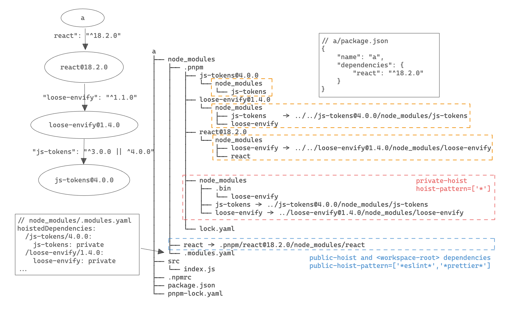

# hoist

## 介绍

本篇主要讲解 pnpm 如何通过使用 symlink 改变 node resolve 寻址过程来创建相互隔离的 node_modules，即 isolated 的拓扑结构。使得每个包只可 resolve 到包内 package.json 中声明的依赖

## hardlink 和 symlink

一般操作系统都支持两种链接方式，软链接 (symlink) 和硬链接 (hardlink) ，他们主要有以下区别，更多信息可查阅维基

1. 源文件删除后，hardlink 的文件不受影响，而 symlink 的文件会失效

2. 目录链接，symlink 可以链接目录而 harklink 不行

3. node resolve 路径有差异，symlink 中 node resolve 的路径是从被 linked 的源文件算起，而 hardlink 和源文件无关

我们以几个例子 (example from hardlink vs symlink) 简单验证下这几个区别

### 删除源文件后的行为

我们先创建一个文件 a，以及其 hardlink 和 symlink

hardlink 文件名为 b，symlink 文件名为 c

```bash
echo "111" > a
ln a b    # hardlink
ln -s a c # symlink
```

此时 a、b、c 的结果为

```bash
cat a --> 111
cat b --> 111
cat c --> 111
```

我们看到 a、b、c 的结果保持同步，如果我们尝试下删除 a 文件，此时我们可以看到

```bash
rm a
cat a --> No such file or directory
cat b --> 111
cat c --> No such file or directory
```

此时可以看到，c 的内容一并被删除，但是 b 的内容不受到影响，我们再尝试将 a 的内容复原

```bash
echo "222" > a
cat a --> 222
cat b --> 111
cat c --> 222
```

此时我们发现 a 和 b 的内容不一致，但是 a 和 c 的内容一致，这反映了 hardlink 和 symlink 的一个重要区别

*   删除文件并不会影响 hardlink 的内容，但是会影响 symlink 的内容

*   文件删除后再恢复内容，那么 hardlink 的 link 关系将不再维持，后续所有变更不会同步到 hardlink 里，但是仍然会和 symlink 保持同步

因为 hardlink 难以保证和原文件的一致性，因此难以保证 hmr 的正常。

### node resolve

另一个区别就是两者在 node resolve 情况下行为的差异

我们创建三个 package

```bash
echo "console.log('resolve:', module.paths[0]);" >> a/index.js
ln a/index.js b/index.js
ln -s a/index.js c/index.js
```

我们看下 三个目录的寻路算法

```bash
node a/index.js --> a/node_modules
node b/index.js --> b/node_modules
node c/index.js --> a/node_modules
```

我们发现对于 hardlink 其 resolve 算法和被 link 的原文件无关，而对于 symlink 其 resolve 算法是从被 linked 的源文件算起，这对于运行时行为是比较大的差异，会影响到最终寻路的结果。

其实 symlink 不一定是基于被 linked 路径算起，大部分的工具和 node 都提供了一个 preserveSymlink 参数 （typescript symlink, webpack symlink, node symlink）

当我们使用 preserveLink 的时候，symlink 的计算路径就是基于该 symlink 的路径而非被 linked 文件路径进行计算。

```bash
node --preserve-symlinks-main --preserve-symlinks c/index.js --> c/node_modules
```

使用 preserveLink 和 hardlink 最大的风险在于，可能导致该查找到的库查找不到，或者同一个库 resolve 到了不同的结果，从而破坏了单例模式和导致 bundle 了多份产物，导致包大小问题。

## 扁平化的 node_modules 结构 和 幻影依赖

npm 和 yarn 中采用扁平化的安装方式。

以如下项目 a 为例，我们在安装 `react@18.2.0` 后，生成的 node_modules 结构如下

```txt
a
├── node_modules
│   ├── .bin
│   ├── js-tokens
│   ├── loose-envify
│   └── react
├── src
│   └── index.js
├── package-lock.json
└── package.json
```

react 及其依赖 loose-envify，和其间接依赖 js-tokens 都被 hoist 上来

由于 nodejs 递归向上查找 node_modules 的算法，在 `a/src/index.js` 中使用 `require('loose-envify')` 运行时正常运行，不会报错。

```json
{
  "name": "a",
  "version": "0.0.1",
  "dependencies": {
    "react": "^18.2.0"
  }
}
```

于是造成我们的项目的 package.json 中使用但并未声明 loose-envify 和 js-tokens

虽然我们的项目现在能跑起来，但是如果哪一天 react 内部实现决定去掉 loose-envify 作为其依赖，或是 loose-envify 内部实现决定去掉 js-tokens，因为 loose-envify 并非作为 react 的对外接口，因此 react 可以选择在小版本上做出这个变动。如果我们的项目选择了语义化版本引入 react，那么这个变动就会导致我们的项目突然无法运行，因为 loose—envify 或 js-tokens 已经不在 node_modules 里了。如果你的项目里有成千上万的依赖，那么你将有很大的概率碰到这种问题。

这种问题称作幻影依赖问题，造成了缺失依赖的 package.json。如果你遇到 `Module xxx not found`，大概率是因为你的 `package.json` 没有写全，或是你使用的第三方包 `package.json` 没有写全。这需要你对错误的第三方包进行更新或者修复。

## pnpm 的 node_modules 结构

同样以上文中的 a 包为例子

```txt
a
├── node_modules
│   ├── .pnpm
│   │   ├── js-tokens@4.0.0
│   │   │   └── node_modules
│   │   │       └── js-tokens
│   │   ├── loose-envify@1.4.0
│   │   │   └── node_modules
│   │   │       ├── js-tokens    -> ../../js-tokens@4.0.0/node_modules/js-tokens
│   │   │       └── loose-envify
│   │   ├── react@18.2.0
│   │   │   └── node_modules
│   │   │       ├── loose-envify -> ../../loose-envify@1.4.0/node_modules/loose-envify
│   │   │       └── react
│   │   ├── node_modules
│   │   │   ├── .bin
│   │   │   │   └── loose-envify
│   │   │   ├── js-tokens -> ../js-tokens@4.0.0/node_modules/js-tokens
│   │   │   └── loose-envify -> ../loose-envify@1.4.0/node_modules/loose-envify
│   │   └── lock.yaml
│   ├── react -> .pnpm/react@18.2.0/node_modules/react
│   └── .modules.yaml
├── src
│   └── index.js
├── .npmrc
├── package.json
└── pnpm-lock.yaml
```


pnpm 创建该结构的大致过程如下（不考虑 peerDependencies）：

1. 利用 hardlink 或 copy 或 clone 等方式从 store 中获取该包

```diff
a
├── node_modules
+ └── .pnpm
+       ├── js-tokens@4.0.0
+       │   └── node_modules
+       │       └── js-tokens
+       ├── loose-envify@1.4.0
+       │   └── node_modules
+       │       └── loose-envify
+       └── react@18.2.0
+           └── node_modules
+               └── react
├── src
│   └── index.js
├── .npmrc
├── package.json
└── pnpm-lock.yaml
```

2. 根据 package.json 创建关联各包 dependencies 的 symlink

```diff
a
├── node_modules
  └── .pnpm
        ├── js-tokens@4.0.0
        │   └── node_modules
        │       └── js-tokens
        ├── loose-envify@1.4.0
        │   └── node_modules
+       │       ├── js-tokens     -> ../../js-tokens@4.0.0/node_modules/js-tokens
        │       └── loose-envify
        └── react@18.2.0
            └── node_modules
+               ├── loose-envify  -> ../../loose-envify@1.4.0/node_modules/loose-envify
                └── react
├── src
│   └── index.js
├── .npmrc
├── package.json
└── pnpm-lock.yaml
```

3. 创建 private-hoist 和 public-hoist

- private-hoist

由 `.npmrc` 中的 [hoist-pattern](https://pnpm.io/npmrc#hoist-pattern) 控制，默认值为 `['*']`

```diff
a
├── node_modules
  └── .pnpm
        ├── js-tokens@4.0.0
        │   └── node_modules
        │       └── js-tokens
        ├── loose-envify@1.4.0
        │   └── node_modules
        │       ├── js-tokens     -> ../../js-tokens@4.0.0/node_modules/js-tokens
        │       └── loose-envify
        └── react@18.2.0
        │   └── node_modules
        │       ├── loose-envify  -> ../../loose-envify@1.4.0/node_modules/loose-envify
        │       └── react
+       └── node_modules
+               ├── loose-envify  -> ../loose-envify@1.4.0/node_modules/loose-envify
+               └── js-tokens     -> ../js-tokens@4.0.0/node_modules/js-tokens
├── src
│   └── index.js
├── .npmrc
├── package.json
└── pnpm-lock.yaml
```

- public-hoist 和 `<workspace-root>/package.json` 中的包

由 `.npmrc` 中的 [public-hoist-pattern](https://pnpm.io/npmrc#public-hoist-pattern) 控制，默认值为 `['*prettier*', '*eslint*']`

```diff
a
├── node_modules
│ └── .pnpm
│       ├── js-tokens@4.0.0
│       │   └── node_modules
│       │       └── js-tokens
│       ├── loose-envify@1.4.0
│       │   └── node_modules
│       │       ├── js-tokens     -> ../../js-tokens@4.0.0/node_modules/js-tokens
│       │       └── loose-envify
│       ├─── react@18.2.0
│       │   └── node_modules
│       │       ├── loose-envify  -> ../../loose-envify@1.4.0/node_modules/loose-envify
│       │       └── react
│       └── node_modules
│               ├── loose-envify  -> ../loose-envify@1.4.0/node_modules/loose-envify
│               └── js-tokens     -> ../js-tokens@4.0.0/node_modules/js-tokens
+├── react -> .pnpm/react@18.2.0/node_modules/react
+└── .modules.yaml
├── src
│   └── index.js
├── .npmrc
├── package.json
└── pnpm-lock.yaml
```

## 不同严格等级的 pnpm 拓扑结构的

事实上 pnpm 支持四种级别的 node_modules 结构，从松到严依次为

详细可见 [pnpm official blog - node_modules 结构](https://pnpm.io/blog/2020/10/17/node-modules-configuration-options-with-pnpm)

### hoisted 模式

与扁平化的结构一样，所有的三方库都平铺在根目录的 node_modules，这意味着 application code 能访问所有的依赖代码（无论是否在 dependency 里），所有的依赖也能互相访问其他依赖的代码 (无论是否在 dependency)，这也是 npm 的默认模式。

```
shamefully-hoist=true
```

### semi strict 模式

这也是 pnpm 的默认模式，这意味着 application code 仅能够访问其依赖里的库（types 和 eslint 相关库除外）, 但是所有的依赖仍然能够互相访问其他依赖的代码。

```ini
; All packages are hoisted to node_modules/.pnpm/node_modules
hoist-pattern[]=*

; All types are hoisted to the root in order to make TypeScript happy
public-hoist-pattern[]=*types*

; All ESLint-related packages are hoisted to the root as well
public-hoist-pattern[]=*eslint*
```

### strict 模式

这种情况下，我们既禁止 application code 访问依赖外的代码，也禁止三方依赖访问其他非依赖里的三方依赖代码。这个模式也是最推荐业务使用的模式，但是不幸的是，pnpm 出于对生态的兼容性，做了妥协，默认并没有设置为该模式，但是作为有追求的业务方的你，应该使用这个模式。这可以保证你的业务不会突然有一天因为依赖问题突然挂掉。

```ini
hoist=false
```

### pnp 模式

即使 pnpm 开了最严格的 strict 模式，但是其只能控制本项目内的 node_modules 的拓扑结构，项目父目录的 node_modules 并不受到影响，所以仍然存在幻影依赖的风险，这个根因在于 node 的 resolve 算法是递归向上查找的，因此在不 hack node resolve 算法的基础上，是无法根除幻影依赖的，所以更激进的方式，就是修改 node 的 resolve 的默认行为，这样就保证了其不会递归向上查找，pnp 即采取了此种方式来根除幻影依赖问题，但是其也会带来新的问题，此处就不再多赘述。

