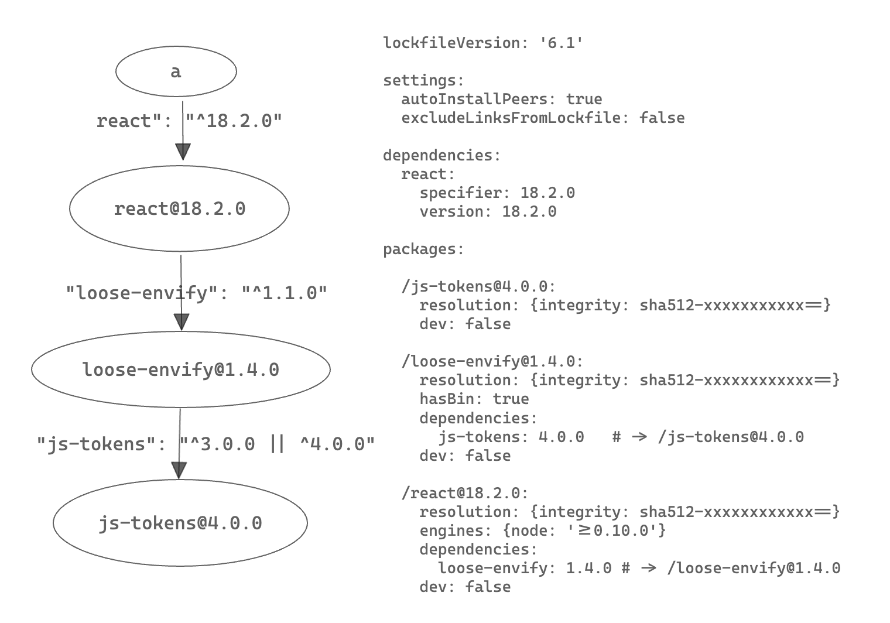

# Lockfile

## 什么是 lockfile？

是依赖关系图的代码表达

以如下项目为例子

```yaml
# pnpm-lock.yaml
lockfileVersion: '6.1'

settings:
  autoInstallPeers: true
  excludeLinksFromLockfile: false

dependencies:
  react:
    specifier: 18.2.0
    version: 18.2.0

packages:

  /js-tokens@4.0.0:
    resolution: {integrity: sha512-RdJUflcE3cUzKiMqQgsCu06FPu9UdIJO0beYbPhHN4k6apgJtifcoCtT9bcxOpYBtpD2kCM6Sbzg4CausW/PKQ==}
    dev: false

  /loose-envify@1.4.0:
    resolution: {integrity: sha512-lyuxPGr/Wfhrlem2CL/UcnUc1zcqKAImBDzukY7Y5F/yQiNdko6+fRLevlw1HgMySw7f611UIY408EtxRSoK3Q==}
    hasBin: true
    dependencies:
      js-tokens: 4.0.0   # -> /js-tokens@4.0.0
    dev: false

  /react@18.2.0:
    resolution: {integrity: sha512-/3IjMdb2L9QbBdWiW5e3P2/npwMBaU9mHCSCUzNln0ZCYbcfTsGbTJrU/kGemdH2IWmB2ioZ+zkxtmq6g09fGQ==}
    engines: {node: '>=0.10.0'}
    dependencies:
      loose-envify: 1.4.0 # -> /loose-envify@1.4.0
    dev: false
```

生成的 lockfile 及对应的依赖关系图为



## 为什么需要 lockfile?

1. 错误复现，依赖安装时，依赖关系图的 snapshot，npm ci，yarn pnpm 的 --frozen-lockfile，可以保证 ci 环境下安装结果的稳定，也可以复现错误现场
2. 依赖关系复用，在最新安装的时候，优先使用已有 lockfile 中的结果，即已有的依赖关系
3. 性能，记录了包的 metadata，如 'deprecated'，可以缩短 resolve 阶段甚至跳过，减少依赖图的生成时间
4. 可读，依赖关系图的代码表达，可追溯

pnpm 官方解释 https://pnpm.io/git#lockfiles

npm 官方解释 https://docs.npmjs.com/cli/v9/configuring-npm/package-lock-json#file-format

## lockfile 的格式？

### pnpm-lock.yaml

一般的 lockfile 主要指 pnpm-lock.yaml

分为

lockfileVersion

- importers （pnpm-workspace.yaml 中扫描到的 workspace）

- - Path 为 key，而不是包名为 key
    - specifier  ^18.2.0 semverRange
    - version       18.2.0 exactVersion

- packages（每个 npm 包的 metaData，减少重复解析）

- - relativeDependencyPath 为  key
    - specifier  ^18.2.0 semverRange
    - version       18.2.0 exactVersion
    - engines  
    - hasBin 
    - deprecated 用来报 warning

- 包名+version 的单例，链式记录（react@18.2.0 -> loose-envify@1.4.0 -> js-token@4.0.0）
- peer 多实例，hash 或 react-dom@17.0.2_react@17.0.2 或 react-dom@17.0.2(react@17.0.2)

### hidden-lockfile

意义：表示现有的 node_modules 状态

node_modules 创建成功后，创建 hidden-lockfile，与 node_modules 更新时间一致，避免重复安装

https://docs.npmjs.com/cli/v9/configuring-npm/package-lock-json#hidden-lockfiles

#### lock.yaml  

位于 node_modules/.pnpm/lock.yaml

是 pnpm 实际使用的 lock 又称 Hidden Lockfiles，跟随 node_modules一起创建

#### modules.yaml

记录 pnpm 的拓朴结构，由 hoist-pattern，public-hoist-pattern，shamefully-hoist 等字段控制

##### 与 npm 的差异

pnpm 和 yarn 并未将这一部分加入到 lockfile pnpm-lock.yaml 中，

- 避免 lockfile 信息过多，冲突过多
- 在 lockfile 不变的情况下，可以由现有配置直接计算得到
- 但 lockfile 变化后，不保证原有拓朴结构不变，所以对于幻影依赖不可追溯，造成 partial-install 和 全量 install 的区别

## Pnpm 是如何生成 lockfile 和使用现有 lockfile 的？（深入的pnpm源码）

- headless install ，即 删除 lockfile 重装 和 已有 lockfile install 的区别
  - preferred-version 算法，如何去重
- pnpm dedupe 

## monorepo下的 lockfile 

split-lock

https://pnpm.io/7.x/npmrc#shared-workspace-lockfile

### shared-workspace-lockfile=true（主流）

- workspace 之间直接 symlink
  - peer不生效，需要 resolve.alias 手动指定

### shared-workspace-lockfile=false

- 每个项目独立安装，每个项目都有独立的 .pnpm 和 pnpm-lock.yaml
- 多份 hardlink，多个实例重打包
- 安装速度慢，preinstall postinstall 脚本重复运行